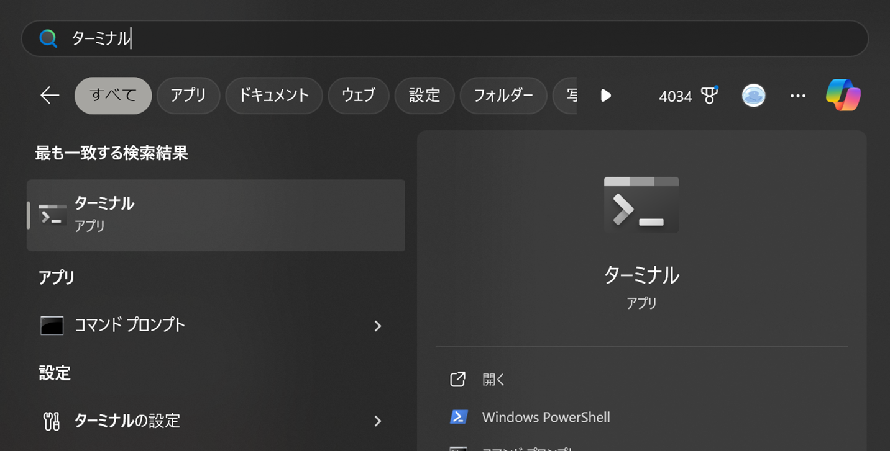
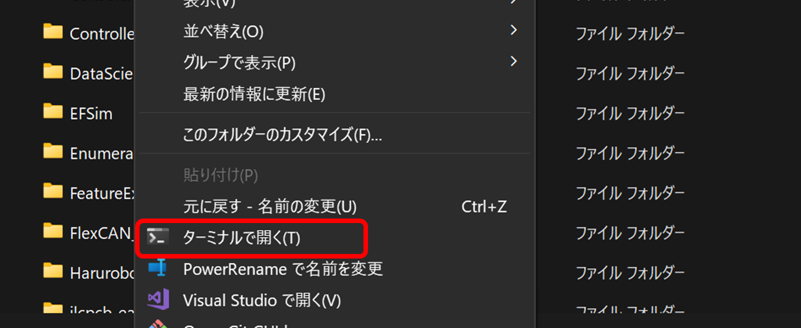

# コマンド

Windows の場合、コマンドはターミナル上で実行します。

今までエクスプローラーで行っていたファイル操作を、コマンドでもできます。

→ 慣れれば速く、文字なので伝えやすい！



ターミナルを起動すると、今いるディレクトリが表示されます。

```sh
~/Desktop/dev
$
```

!!! note

    エクスプローラーからも起動できます。(開きたいディレクトリを右クリック)

    ディレクトリに移動した状態で起動してくれます！

    

## 使えると熱いコマンドたち

- 🌟 ls
- 🌟 cd
- 🌟 start
- 🌟 code
- 🌟 winget
- 🌟 git
- mv (移動、名前変更)
- cp (コピー)
- touch (ファイル作成)
- mkdir (ディレクトリ作成)
- ...

使いつつ覚えていけば大丈夫です。エクスプローラーでの操作に対応したコマンドがあることが分かれば、グーグルニキが教えてくれます！

### 🌟 **ls コマンド**

ディレクトリ内のファイル、ディレクトリを列挙する

```sh
ls
```

結果

```sh
~/Desktop/dev
ls

AA/                   ConsoleApplication3/  Harurobo2023-Ateam/  OpenSiv3D_0.6.141/  rust-test/         WeatherApp-1/
addlinenum/           ConsoleApplication4/  IRRemoteControl/     OpenSiv3D_0.6.142/  SortAlgorithm/     Website/
apptest/              ControllerUnit/       ...
```

### 🌟 **cd コマンド**

ディレクトリ間を移動する

```sh
cd <ディレクトリ名>
```

結果

```sh
~/Desktop
cd dev/

~/Desktop/dev
```

`cd ..` で一つ上のディレクトリへ移動できます。

```sh
~/Desktop/dev
cd ..

~/Desktop
```

`cd -` でもと居たディレクトリに戻れます。

```sh
~/Desktop/dev/Robocon2024-Bteam
cd ../../

~/Desktop
cd -

~/Desktop/dev/Robocon2024-Bteam
```

!!! note

    ディレクトリ名は全て入力する必要はありません。途中まで打ち Tab キーを押すことで補完できます。

    ```sh
    cd robo
    ```

    ↓ Tab キー

    ```sh
    cd Robocon2024-Bteam/
    ```

### 🌟 **特殊なディレクトリ**

```sh
~/Desktop/dev
ls -la

total 130022
drwxr-xr-x 1 user 197609         0 12月 15 23:25 ./     ← コレ
drwxr-xr-x 1 user 197609         0 12月 15 01:14 ../    ← コレ
drwxr-xr-x 1 user 197609         0 12月 15 23:14 AA/
```

`.` 今いるディレクトリ

`..` 親ディレクトリ 🌟

`~` ホームディレクトリ (C:/Users/ユーザー名)

`/` ルートディレクトリ (C:/)

### 🌟 **start コマンド**

ファイルやディレクトリを既定のプログラムで開く

エクスプローラー上でクリックするのと同じ。結構使います！

```sh
start <ファイル名 or ディレクトリ名>
```


### 🌟 **code コマンド**

VSCode を開くコマンド

```sh
~/Desktop/dev/Robocon2024-Bteam
code .
```

結果


### 🌟 **winget コマンド**

Window 用パッケージマネージャー

コマンド一つでアプリをインストールできるので超楽。

例) Git のインストール <https://git-scm.com/downloads/win>

```sh
winget install --id Git.Git -e --source winget
```
