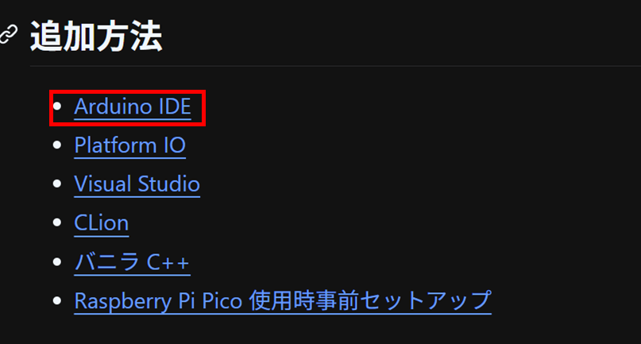
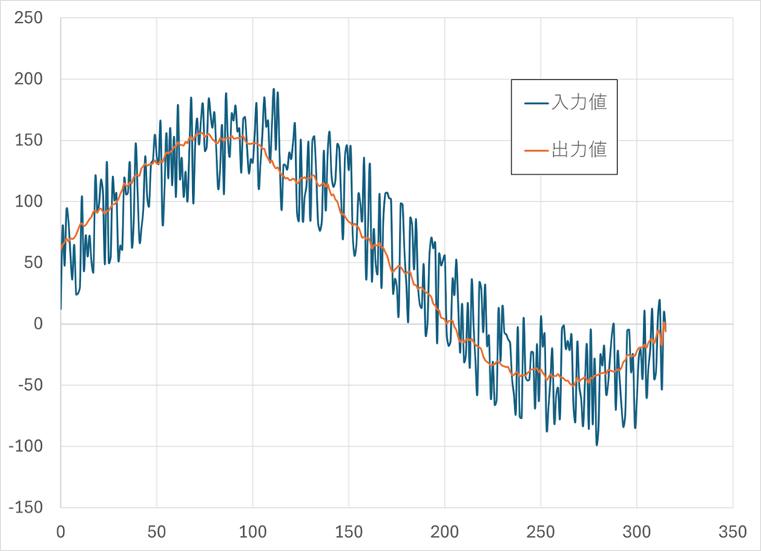
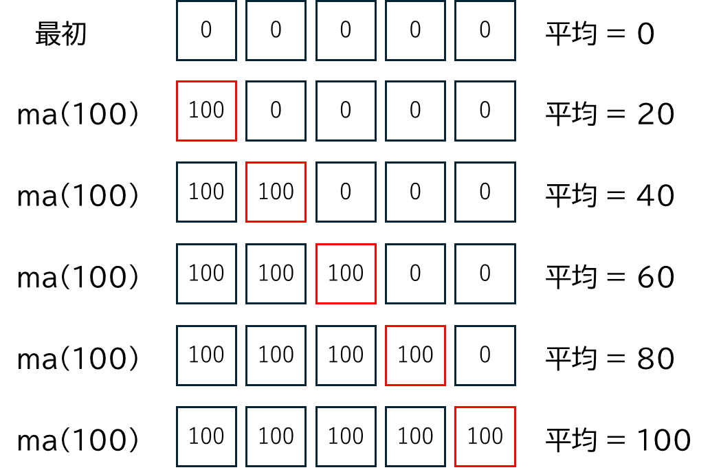
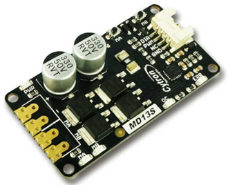
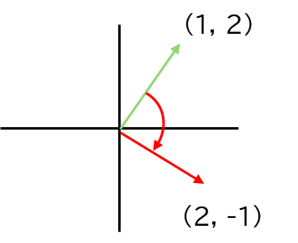
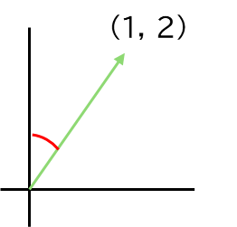

# UdonLibrary の使い方

UdonLibrary は部のライブラリです。

<https://github.com/udonrobo/UdonLibrary>

ロボコンの度に毎回一から書いていると大変なので、よく書くコードを UdonLibrary 内で実装し、呼び出すだけで簡単にプログラムを書けるようにしています。

## 開発経緯・歴史

追える範囲だと部のライブライは 2016 年から存在しています。当時はヘッダーファイルが集まった zip ファイルを回す形で利用していました。

CAN 通信への移行に伴って、ライブラリを整理し、GitHub で管理する形になりました。UdonLibrary は 2022/09 から存在します。

## 主な機能

通信系

- CAN
- I2C
- USB シリアル
- 無線
- PS5 コントローラー

アルゴリズム系

- ループ周期制御
- フィードバック制御
- 移動平均

デバイスドライバ系

- モーター
- ロボマスモーター
- サーボモーター
- エンコーダー
- ジャイロ
- 7 セグメント LED

ユーザー定義型系

- 二次元ベクトル
- 色空間
- オイラー角
- クォータニオン

## インストール方法

UdonLibrary のリポジトリをクローンします。Arduino のライブラリフォルダにクローンします。

インストール方法はライブラリのドキュメントに記載されています。

<https://github.com/udonrobo/UdonLibrary/blob/master/docs/Install/ArduinoIDE.md>



## 使い方

### 🌟 ライブラリのインクルード

`Udon.hpp` をインクルードすると全ての機能が使えるようになります。

```cpp
#include <Udon.hpp>

void setup()
{
}

void loop()
{
}
```

### 🌟 プログラムを書く

基本的にドキュメントを参照すると使い方が書いてあります。

モーターの場合)

```cpp
#include <Udon.hpp>

static Udon::Motor3 motor{ 0, 1, 2 };

void setup()
{
    motor.begin();
}

void loop()
{
    motor.move(200);
}
```

!!! note "static について"

    `static` (静的) な変数にすることで、他のソースファイルからアクセスできなくなります。

    static な変数はそのファイル内でのみ使われることが確約されるため、他のファイルから使われているか考慮する必要がなくなり安心できます。

### 🌟 中身の見方

実装を見たい場合、`src` フォルダにソースコードがあります。GitHub や VSCode で見ることができます。

VSCode で開く場合)

```sh
code ~/Documents/Arduino/libraries/UdonLibrary
```

## クラスの紹介

### 🌟 `Udon::MovingAverage`

谷川大先輩が実装した移動平均クラスです。簡単に言うと変化を滑らかにしてくれるクラスで、モーターの出力値を滑らかにするのに使います。

内部には配列があり、そのサイズをテンプレート引数で指定します。配列のサイズが大きいほど滑らかになりますが、遅れが生じます。

モーターを動かすマイコンで使い、メインマイコンでは使いません。

```cpp
#include <Udon.hpp>

static Udon::MovingAverage<50> ma;

void setup()
{
}

void loop()
{
    int power = 100;

    int smooth_power = ma(power);  // これだけ！

    motor.move(smooth_power);

    delay(10);
}
```

移動平均をかける前と後のグラフです。

{width=600px}

呼び出す度に図のように配列が更新されていき、平均値が返されます。そのため、配列の個数回呼び出すと、指定の値に到達します。

{width=600px}

### 🌟 `Udon::LoopCycleController`

<https://github.com/udonrobo/UdonLibrary/blob/master/docs/Algorithm/LoopCycleController.md>

### 🌟 `Udon::BNO055`

<https://github.com/udonrobo/UdonLibrary/blob/master/docs/Driver/BNO055.md>

### 🌟 `Udon::Motor3, Motor2`

`Udon::Motor3` クラスは、前回作ったモータークラスと移動平均クラスを組み合わせたクラスです。

`Udon::Motor2` クラスは制御信号線が 2 本のモータードライバを制御するクラスです。



### 🌟 `Udon::Vec2`

x, y を持つ構造体 + 便利なメンバ関数モリモリなユーザー定義型です。次のように定義されています。

```cpp
namespace Udon
{
    struct Vec2
    {
        double x;
        double y;
    };
}
```

#### ベクトルの長さを求める

<div class="grid" markdown>

```cpp title="length()"
Udon::Vec2 v{ 3, 4 };
double length = v.length();  // 5
```

{width=180px}

</div>

#### ベクトルを回転させる

<div class="grid" markdown>

```cpp title="rotated()"
Udon::Vec2 vector{ 1, 2 };
Udon::Vec2 rotated = vector.rotated(Udon::PI / 2);  // 90 度時計回りに回転
```

{width=180px}

</div>

#### ベクトル同士の演算

<div class="grid" markdown>

```cpp title="operator+()"
Udon::Vec2 vector0{ 1, 2 };
Udon::Vec2 vector1{ 1, -1 };

Udon::Vec2 sum = vector0 + vector1;  // (2, 1)
```


</div>

#### 角度を求める

<div class="grid" markdown>

```cpp title="angle()"
Udon::Vec2 vector{ 1, 2 };
double angle = vector.angle();
```

{width=180px}

</div>

### 🌟 `Udon::Optional`

有効な値を持つか、もしくは無効かを表す型です。通信の受信エラーの判別に使います。

<https://github.com/udonrobo/UdonLibrary/blob/master/docs/Types/Optional.md>
